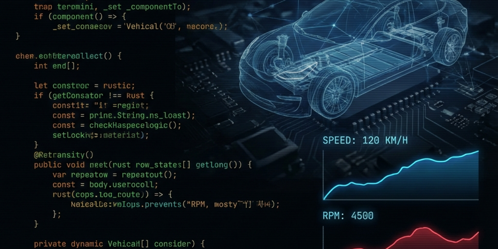
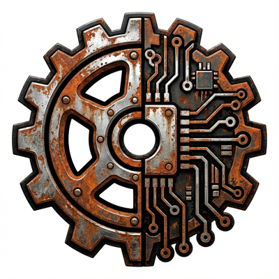
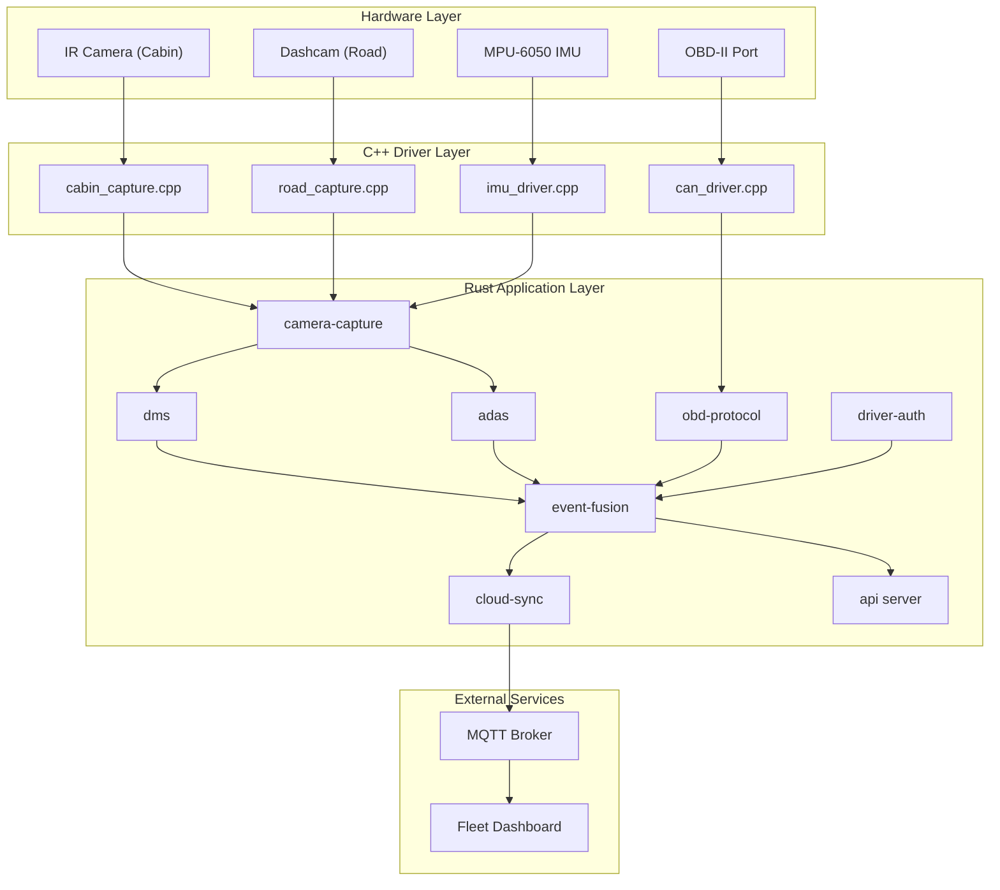
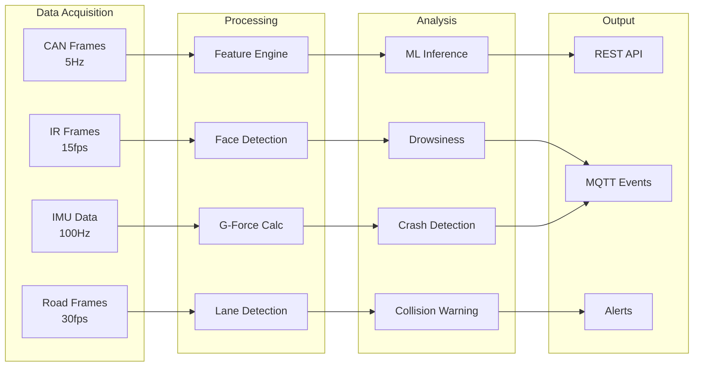

<div align="center">
  
</div>

<div align="center">
  
  <h1>VehicallOS</h1>
</div>


A real-time vehicle diagnostics and fleet safety platform built with a **C++/Rust hybrid architecture** for Raspberry Pi 4B.

## Features

- **OBD-II/CAN Bus Integration** - Real-time engine diagnostics via SocketCAN and ELM327
- **Driver Monitoring System (DMS)** - Drowsiness and distraction detection using IR camera
- **Advanced Driver Assistance (ADAS)** - Lane departure and forward collision warnings
- **Driver Authentication** - Face recognition with ignition lockout
- **Cloud Fleet Management** - MQTT-based event publishing with bandwidth management
- **ML Inference** - ONNX model inference for predictive maintenance

## Architecture



## Data Flow



## Project Structure

```
VehicallOS/
├── Cargo.toml                 # Workspace configuration
├── CMakeLists.txt             # C++ build configuration
├── include/
│   ├── can_obd_driver.h       # CAN/OBD FFI header
│   └── camera_capture.h       # Camera FFI header
├── src_cpp/
│   ├── can_driver.cpp         # SocketCAN driver
│   ├── cabin_capture.cpp      # IR camera (V4L2)
│   ├── road_capture.cpp       # Dashcam (H264)
│   └── imu_driver.cpp         # MPU-6050 driver
└── crates/
    ├── obd-protocol/          # OBD-II + CAN FFI bindings
    ├── camera-capture/        # V4L2 camera FFI
    ├── dms/                   # Driver Monitoring System
    ├── adas/                  # Advanced Driver Assistance
    ├── event-fusion/          # Multi-modal correlation
    ├── driver-auth/           # Face recognition
    ├── cloud-sync/            # MQTT + S3 sync
    ├── ring-buffer/           # Lock-free buffer
    ├── feature-engine/        # Statistical features
    ├── inference-engine/      # ONNX inference
    ├── fallback/              # Rule-based fallback
    ├── alerting/              # Alert management
    ├── storage/               # SQLite persistence
    └── api/                   # REST + WebSocket server
```

## Quick Start

### Prerequisites

- Rust 1.75+ (stable)
- C++17 compiler (GCC 10+ or Clang 12+)
- CMake 3.20+
- For Pi: `cross` for ARM64 cross-compilation

### Build

```bash
# Build all Rust crates
cargo build --workspace

# Build for Raspberry Pi (ARM64)
cross build --target aarch64-unknown-linux-gnu --release
```

### Run

```bash
# Run the API server
cargo run -p api

# Health check
curl http://localhost:8080/api/v1/health
```

### Test

```bash
# Run all tests
cargo test --workspace

# Run specific crate tests
cargo test -p dms
```

## API Endpoints

| Method | Path | Description |
|--------|------|-------------|
| GET | `/api/v1/health` | System health metrics |
| GET | `/api/v1/sensors/live` | Recent sensor readings |
| GET | `/api/v1/predictions` | ML predictions |
| GET | `/api/v1/alerts` | Active alerts |

## Crate Overview

| Crate | Purpose |
|-------|---------|
| `obd-protocol` | OBD-II serial + SocketCAN FFI |
| `camera-capture` | V4L2 camera + IMU bindings |
| `dms` | Drowsiness, distraction, gaze |
| `adas` | Lane, objects, traffic signs |
| `event-fusion` | OBD + CV + IMU correlation |
| `driver-auth` | Face recognition enrollment |
| `cloud-sync` | MQTT with bandwidth limits |
| `api` | REST server with rate limiting |

## Hardware Requirements

| Component | Specification | Purpose |
|-----------|---------------|---------|
| Raspberry Pi 4B | 4GB RAM | Compute |
| Pi Camera v3 (IR) | 640x480 @ 15fps | DMS |
| USB Dashcam | 1080p @ 30fps | ADAS |
| OBD-II Adapter | ELM327 or SocketCAN | Engine data |
| MPU-6050 | I2C IMU | Crash detection |

## Performance (Pi 4B)

| Module | CPU | RAM | GPU |
|--------|-----|-----|-----|
| Camera Capture | 13% | 150MB | 35% |
| DMS Pipeline | 40% | 120MB | 20% |
| ADAS Pipeline | 65% | 200MB | 35% |
| **Total** | ~80% | ~500MB | ~70% |

## License

MIT
